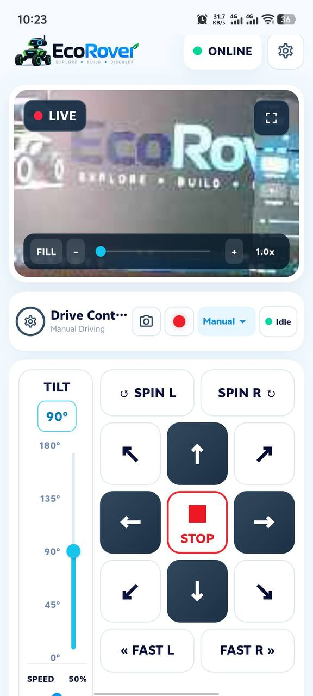
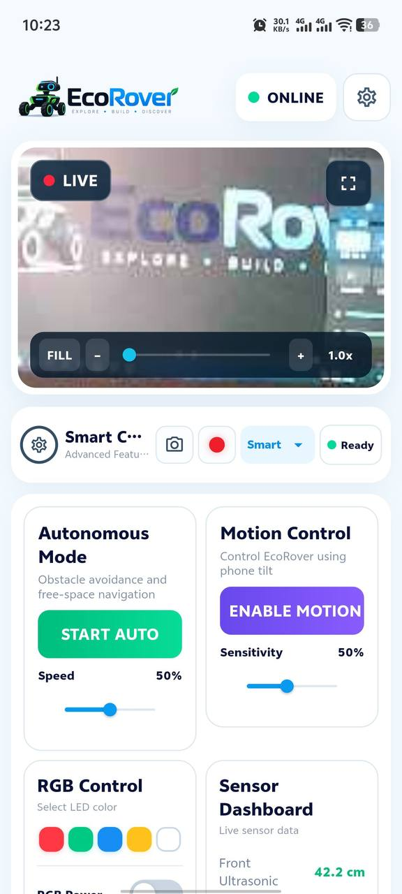
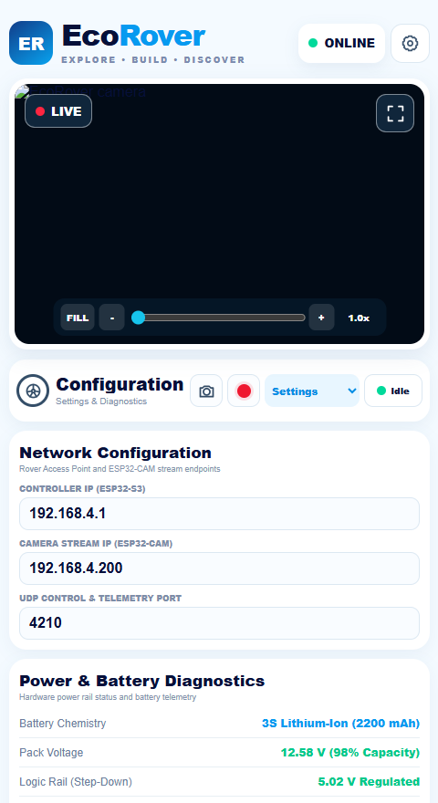

<div align="center">


<br/><br/>


# EcoRover

### ESP32-S3 Smart Rover with Wi-Fi Control, Autonomous Navigation, Phone Motion Control, Live ESP32-CAM Streaming, Sensor Monitoring, and a Flutter Mobile Application

[](https://github.com/)
[](release/EcoRover.apk)
[](firmware/)
[](hardware/)
[](firmware/esp32-camera/)
[](flutter-app/)
[](flutter-app/android/)
[](flutter-app/test/)
[](LICENSE)

</div>

---

## 📖 Table of Contents
- [Project Overview](#-project-overview)
- [System Architecture](#-system-architecture)
- [Visual Gallery & User Interfaces](#-visual-gallery--user-interfaces)
- [Repository Structure](#-repository-structure)
- [Subsystems & Core Features](#-subsystems--core-features)
  - [1. ESP32-S3 Main Controller](#1-esp32-s3-main-controller-firmware)
  - [2. ESP32-CAM Video Node](#2-esp32-cam-wireless-video-node)
  - [3. Flutter Mobile Application](#3-flutter-mobile-application)
  - [4. Web Control Dashboard](#4-web-control-dashboard)
- [Hardware & Circuit Architecture](#-hardware--circuit-architecture)
  - [Bill of Materials (BOM)](#bill-of-materials-bom)
  - [GPIO Pin Mapping Table](#gpio-pin-mapping-table)
  - [Power Distribution & Electrical Safety](#power-distribution--electrical-safety)
- [Network & Communication Topology](#-network--communication-topology)
- [Quick Start Guide](#-quick-start-guide)
  - [Firmware Setup](#firmware-setup)
  - [Testing & Validation](#-testing--validation)
- [Mobile App Download (APK)](#-mobile-app-download-apk)
- [Team & Core Responsibilities](#-team--core-responsibilities)
- [License](#-license)

---

## 🚀 Project Overview

**EcoRover** is an advanced, holonomic mecanum-wheel robotic platform built for wireless exploration, autonomous obstacle avoidance, and real-time computer vision telemetry. Powered by an **ESP32-S3 N16R8** dual-core microcontroller and a dedicated **ESP32-CAM** wireless video node, the rover is controlled via an in-house **Flutter mobile application** (Android) and a zero-dependency **Web Control Dashboard**.

### Core Capabilities:
- **12-Direction Mecanum Kinematics**: Forward, backward, smooth progressive curves, lateral fast strafing (left/right), spin in place, and 4 diagonal vectors.
- **Dual-Core LEDC PWM Engine**: Non-conflicting hardware timers for 4 DC motor channels (1500 Hz, 8-bit) and 2 pan/tilt servo channels (50 Hz, 14-bit).
- **Independent Wireless Camera Node**: ESP32-CAM streaming low-latency 640x480 VGA MJPEG video directly over HTTP (`192.168.4.200/stream`).
- **Autonomous Free-Space Navigation**: Algorithmic decision logic utilizing front/rear ultrasonic sensors and right-side infrared obstacle sensing.
- **Phone Motion Control**: High-speed UDP stream (33 Hz) transmitting calibrated accelerometer tilt vectors with 50-sample tare normalization and packet failsafe.
- **5-Sensor Telemetry Dashboard**: Real-time monitoring of front distance, rear distance, right IR obstacle state, ambient light (LDR), and automated headlights.
- **Media Pipeline**: Native Android photo snapshot capture and H.264 MP4 video recording using `ffmpeg_kit_flutter_new`.

---

## 🏛 System Architecture

The EcoRover ecosystem utilizes a multi-node, decoupled IoT architecture. The main controller generates a localized Wi-Fi Access Point (`EcoRover`), allowing both the ESP32-CAM station and the mobile client to communicate over deterministic local IP addresses without requiring an external router or internet connectivity.

```
+=======================================================================================+
|                                     CLIENT LAYER                                      |
|                                                                                       |
|   +---------------------------------------+   +-----------------------------------+   |
|   |         Flutter Mobile Client         |   |        Web Control Console        |   |
|   |   (Android 7.0+ / Riverpod State)     |   |     (HTML5 / CSS3 / Vanilla JS)   |   |
|   +---------------------------------------+   +-----------------------------------+   |
+=======================================================================================+
                   |                                       |
    [HTTP 192.168.4.1] [UDP 2055]           [HTTP 192.168.4.1]  [MJPEG 192.168.4.200]
                   |                                       |               |
+===================================================================+      |
|                   LOCAL WI-FI NETWORK (SSID: EcoRover)            |      |
+===================================================================+      |
         |                                                                 |
         v                                                                 v
+------------------------------------+                  +-----------------------------------+
|     ESP32-S3 MAIN CONTROLLER       |                  |         ESP32-CAM NODE            |
|       (IP: 192.168.4.1)            |                  |      (IP: 192.168.4.200)          |
|------------------------------------|                  |-----------------------------------|
| • WebServer REST API (Port 80)     |                  | • GC2145 / OV2640 Image Sensor    |
| • UDP Datagram Receiver (Port 2055)|                  | • 640x480 VGA MJPEG Server        |
| • 12-Movement Mecanum Kinematics   |                  | • Station Mode (EcoRover AP)      |
| • 4x Motor LEDC PWM (1500 Hz)      |                  | • Endpoint: /stream & /snapshot   |
| • 2x Turret Servo PWM (50 Hz)      |                  +-----------------------------------+
| • 5-Sensor Polling & Heartbeat     |
| • SH1106 128x64 I2C OLED Display   |
+------------------------------------+
         |                        |
         v                        v
+------------------+    +-------------------------------------------------------------------+
| DUAL L298N H-MOD |    | SENSORS, ACTUATORS & FEEDBACK                                     |
|------------------|    |-------------------------------------------------------------------|
| • Front-Left     |    | • Front HC-SR04 Ultrasonic (GPIO6 TRIG / GPIO7 ECHO via Divider)  |
| • Rear-Left      |    | • Rear HC-SR04 Ultrasonic (GPIO10 TRIG / GPIO11 ECHO via Divider) |
| • Front-Right    |    | • Right IR Digital Sensor (GPIO15 INPUT_PULLUP)                   |
| • Rear-Right     |    | • LDR Ambient Photocell (GPIO4 ADC1)                              |
| • 4x TT Motors   |    | • Pan/Tilt Servos (GPIO12 & GPIO13)                               |
+------------------+    | • Built-in Addressable WS2812 RGB (GPIO48) & Active Buzzer (14)   |
                        +-------------------------------------------------------------------+
```

---

## 📸 Visual Gallery & User Interfaces

<div align="center">


<br/><br/>


<br/><br/>

<table align="center" width="100%">
  <thead>
    <tr>
      <th width="33.3%" align="center"><b>Manual Locomotion Mode</b></th>
      <th width="33.3%" align="center"><b>Smart Autonomy &amp; Telemetry</b></th>
      <th width="33.3%" align="center"><b>Hardware Settings &amp; Diagnostics</b></th>
    </tr>
  </thead>
  <tbody>
    <tr>
      <td align="center" valign="top">
        
      </td>
      <td align="center" valign="top">
        
      </td>
      <td align="center" valign="top">
        
      </td>
    </tr>
    <tr>
      <td align="center" valign="top">
        <sub><b>Manual Drive &amp; Turret</b><br/>Live FPV camera stream, 180° pan/tilt servos, PWM speed regulator &amp; 3×3 mecanum D-pad</sub>
      </td>
      <td align="center" valign="top">
        <sub><b>Autonomous &amp; Sensors</b><br/>Obstacle avoidance, phone tilt motion steering, 5-color RGB lighting &amp; real-time sensor dashboard</sub>
      </td>
      <td align="center" valign="top">
        <sub><b>System Configuration</b><br/>Controller &amp; camera stream IPs, UDP port, 2200 mAh 3S battery monitoring &amp; node diagnostics</sub>
      </td>
    </tr>
  </tbody>
</table>

</div>

---

## 📂 Repository Structure

The repository is organized into distinct, modular subsystems:

```
EcoRover/
│
├── README.md                           # Master repository documentation & architecture guide
├── LICENSE                             # MIT Open-Source License
├── .gitignore                          # Comprehensive ignore rules (Flutter, Android, Arduino)
├── CHANGELOG.md                        # Production release history & versioning
│
├── release/                            # Pre-built production binaries
│   ├── EcoRover.apk                    # Ready-to-install Universal Android APK (API 24 to 34)
│   └── README.md                       # Sideloading & installation guide
│
├── firmware/                           # Embedded microcontroller firmware
│   ├── main-controller/                # ESP32-S3 N16R8 core rover firmware
│   │   ├── EcoRover_V6.ino             # Production C++ Arduino sketch (v1.0.0 / V6 architecture)
│   │   ├── dashboard_gz.h              # Compressed GZIP binary header of web dashboard
│   │   └── README.md                   # Flashing guide, board specs & compiler settings
│   │
│   └── esp32-camera/                   # Dedicated wireless video streaming node
│       ├── EcoRover_Camera.ino         # ESP32-CAM station firmware (static IP 192.168.4.200)
│       └── README.md                   # FTDI flashing wiring and camera registers
│
├── flutter-app/                        # Cross-platform mobile controller source code
│   ├── lib/                            # Dart application source (Riverpod state management)
│   │   ├── app/                        # Theme tokens, color palettes & global constants
│   │   ├── models/                     # RoverStatus and RoverMode JSON serialization models
│   │   ├── providers/                  # Rover status polling, camera state & motion providers
│   │   ├── screens/                    # Splash, Controller, Fullscreen HUD & Settings views
│   │   ├── services/                   # HTTP REST client, MJPEG parser, UDP streaming & FFmpeg
│   │   └── widgets/                    # Modular UI components (D-pad, camera card, gauges)
│   ├── android/                        # Android native platform embedding & network security
│   ├── assets/                         # Vector icons, splash branding & raster assets
│   ├── test/                           # 44 comprehensive unit test suite
│   ├── pubspec.yaml                    # Flutter project dependencies
│   └── README.md                       # Mobile build & installation guide
│
├── web-dashboard/                      # Zero-dependency browser control console
│   ├── dashboard.html                  # Responsive HTML5 user interface
│   ├── dashboard.js                    # Telemetry polling, slider events & MJPEG embedding
│   ├── dashboard_gz.h                  # Pre-compiled GZIP byte array
│   └── README.md                       # Web console guide and compression instructions
│
├── hardware/                           # Physical engineering documentation
│   ├── circuit-diagram/                # Schematics and electrical architecture
│   │   ├── EcoRover_Circuit.png        # High-resolution wiring diagram
│   │   └── README.md                   # Power rail analysis & voltage divider math
│   ├── pin-map/
│   │   └── GPIO_Pin_Map.md             # Authoritative ESP32-S3 & ESP32-CAM GPIO allocations
│   └── components/
│       └── Components_List.md          # Complete Bill of Materials (BOM) & hardware specs
│
├── docs/                               # Engineering reports & operational guides
│   ├── report/
│   │   └── EcoRover_Complete_Project_Report.md  # Full 17-section university project report
│   ├── images/                         # Project photographs, schematics & screenshots
│   ├── setup/                          # Step-by-step setup guides
│   │   ├── Main_Controller_Setup.md    # ESP32-S3 Arduino IDE configuration
│   │   ├── ESP32_CAM_Setup.md          # ESP32-CAM FTDI flashing instructions
│   │   └── Flutter_App_Setup.md        # Flutter Android APK build instructions
│   └── troubleshooting/
│       └── Troubleshooting.md          # 15 engineering challenges & definitive resolutions
│
└── tests/                              # Hardware bring-up and diagnostic test sketches
    ├── motor-tests/                    # Independent 4-wheel direction & PWM test sketch
    ├── sensor-tests/                   # Dual ultrasonic, IR, and LDR diagnostic sketch
    └── wifi-tests/                     # SoftAP latency & UDP 33Hz packet throughput monitor
```

---

## ⚙️ Subsystems & Core Features

### 1. ESP32-S3 Main Controller Firmware
- **Locomotion Kinematics**:
  - `Forward` / `Backward`: All wheels in positive / negative rotation.
  - `Curve Left` / `Curve Right`: Directional differential drive (inner wheels at 55% base speed).
  - `FAST Strafe Left`: Mecanum vector pattern `FL(-) RL(+) FR(+) RR(-)`.
  - `FAST Strafe Right`: Mecanum vector pattern `FL(+) RL(-) FR(-) RR(+)`.
  - `Spin Left` / `Spin Right`: Counter-rotational pivot around central chassis axis.
  - `Diagonals`: Individual diagonal wheel pairs activated.
- **LEDC Hardware Channels**:
  - `CH0` to `CH3`: FL, RL, FR, RR Motors at 1500 Hz (8-bit resolution, 0-255).
  - `CH4` & `CH5`: Pan & Tilt Servos at 50 Hz (14-bit resolution).
- **Heartbeat Safety Failsafe**: Manual mode requires continuous HTTP polling. If communications drop for >4.0 seconds, motors are automatically cut.

### 2. ESP32-CAM Wireless Video Node
- Runs independently as a station connected to the `EcoRover` AP.
- Static IP: `192.168.4.200`.
- Serves multipart JPEG chunks via `/stream` at 25-30 FPS.
- Still snapshot endpoint available at `/snapshot`.

### 3. Flutter Mobile Application
- **State Management**: Built using `flutter_riverpod` with clean Separation of Concerns (SoC).
- **Responsive Layout**: Adapts between portrait manual driving and landscape fullscreen camera HUD.
- **Motion Sensor Engine**: Streams phone tilt accelerometer vectors via UDP port 2055 at 33 Hz.
- **Media Engine**: Instant JPEG gallery snapshots and H.264 MP4 recording via FFmpeg Kit.

### 4. Web Control Dashboard
- Zero-installation browser interface embedded directly into ESP32 Flash as GZIP bytes.
- Connect to `http://192.168.4.1` on any device connected to the rover's Wi-Fi network.

---

## 🔌 Hardware & Circuit Architecture

### Bill of Materials (BOM)
| Subsystem | Component | Quantity | Key Specifications |
|:---|:---|:---:|:---|
| **MCU** | ESP32-S3-WROOM-1 N16R8 | 1 | 240 MHz Dual-Core, 16MB Flash, 8MB OPI PSRAM |
| **Camera** | AI-Thinker ESP32-CAM | 1 | 2MP GC2145 / OV2640 Sensor |
| **Drivers** | L298N Dual H-Bridge | 2 | Left & Right side isolated motor drivers |
| **Motors** | TT DC Geared Motors | 4 | 1:48 gear ratio with 60mm Mecanum Wheels |
| **Servos** | SG90 / MG90S Micro Servos | 2 | Pan (horizontal) & Tilt (vertical) camera mount |
| **Sensors** | HC-SR04 Ultrasonic | 2 | Front (30cm obstacle limit) & Rear (25cm limit) |
| **Sensors** | IR Obstacle Sensor | 1 | Right-side obstacle detection (Active LOW) |
| **Sensors** | LDR Photocell | 1 | Ambient illumination sensing (10kΩ divider) |
| **Display** | SH1106 1.3" OLED | 1 | 128x64 I2C Real-time telemetry display |
| **Power** | 2200 mAh 3S Lithium Battery Pack | 1 | 11.1V - 12.6V (2200 mAh) high-discharge motor power supply |
| **Regulator**| LM2596 Buck Converter | 1 | Step-down 12V to 5.0V / 3A logic supply |

### GPIO Pin Mapping Table
| Function | GPIO Pin | Signal Type | Electrical Notes |
|:---|:---:|:---:|:---|
| **LDR Sensor** | GPIO4 | ADC1 Analog | 10kΩ pull-down divider |
| **Headlights** | GPIO5 | Digital Output | 3.3V switching circuit |
| **Front Ultrasonic TRIG** | GPIO6 | Digital Output | 10µs trigger pulse |
| **Front Ultrasonic ECHO** | GPIO7 | Digital Input | **5V to 3.3V Divider: 1kΩ (upper) / 2kΩ (lower)** |
| **OLED Display SDA** | GPIO8 | I2C Data | 3.3V Logic |
| **OLED Display SCL** | GPIO9 | I2C Clock | 3.3V Logic |
| **Rear Ultrasonic TRIG** | GPIO10 | Digital Output | 10µs trigger pulse |
| **Rear Ultrasonic ECHO** | GPIO11 | Digital Input | **5V to 3.3V Divider: 1kΩ (upper) / 2kΩ (lower)** |
| **Pan Servo (Turret)** | GPIO12 | LEDC CH4 | 50 Hz PWM (0° - 180°) |
| **Tilt Servo (Turret)**| GPIO13 | LEDC CH5 | 50 Hz PWM (0° - 180°) |
| **Active Buzzer** | GPIO14 | Digital Output | Active HIGH alert |
| **Right IR Sensor** | GPIO15 | Digital Input | `INPUT_PULLUP` (LOW = Obstacle) |
| **FL Motor Direction** | GPIO17 (IN1), GPIO16 (IN2) | Digital Output | Front-Left Motor |
| **FL Motor Speed** | GPIO39 (EN) | LEDC CH0 | 1500 Hz (8-bit PWM) |
| **RL Motor Direction** | GPIO18 (IN1), GPIO21 (IN2) | Digital Output | Rear-Left Motor |
| **RL Motor Speed** | GPIO38 (EN) | LEDC CH1 | 1500 Hz (8-bit PWM) |
| **FR Motor Direction** | GPIO1 (IN1), GPIO2 (IN2) | Digital Output | Front-Right Motor |
| **FR Motor Speed** | GPIO42 (EN) | LEDC CH2 | 1500 Hz (8-bit PWM) |
| **RR Motor Direction** | GPIO41 (IN1), GPIO40 (IN2) | Digital Output | **Authoritative Pin: GPIO40 for IN2** |
| **RR Motor Speed** | GPIO47 (EN) | LEDC CH3 | 1500 Hz (8-bit PWM) |
| **Built-in RGB LED** | GPIO48 | Addressable WS2812 | On-board system status |

### Power Distribution & Electrical Safety
1. **Isolated Rails**: Never supply 12V directly to any ESP32 board pin.
2. **Common Ground**: Battery negative, buck converter ground, ESP32 grounds, motor driver grounds, and sensor grounds are unified in a single star-ground topology.
3. **Logic Protection**: HC-SR04 5V ECHO signals are scaled to 3.33V via $V_{out} = 5.0\text{V} \times \frac{2\text{k}\Omega}{1\text{k}\Omega + 2\text{k}\Omega}$ to prevent latch-up and damage to ESP32 inputs.

---

## 🌐 Network & Communication Topology

| Network Role | Device | IP Address | Protocol & Port | Purpose |
|:---|:---|:---:|:---:|:---|
| **Access Point (AP)** | ESP32-S3 Controller | `192.168.4.1` | Wi-Fi 802.11 b/g/n (Ch 1) | Network broadcast (`SSID: EcoRover`) |
| **Station (STA)** | ESP32-CAM Node | `192.168.4.200` | HTTP Port 80 | MJPEG Video Stream (`/stream`) |
| **Client** | Android Phone | `192.168.4.x` | HTTP Port 80 | REST commands & status polling |
| **Motion Client** | Android Phone | `192.168.4.x` | UDP Port 2055 | 33 Hz accelerometer data streaming |

---

## 🛠 Quick Start Guide

### Firmware Setup
1. Open `firmware/main-controller/EcoRover_V6.ino` in Arduino IDE.
2. Ensure `dashboard_gz.h` is in the same folder.
3. Select board **ESP32S3 Dev Module** with settings:
   - **Flash Size**: 16MB (128Mb)
   - **Partition Scheme**: 16M Flash (3MB APP/9.9MB FATFS)
   - **PSRAM**: OPI PSRAM
   - **USB CDC On Boot**: Enabled
4. Flash the sketch to the ESP32-S3.
5. Flash `firmware/esp32-camera/EcoRover_Camera.ino` to the ESP32-CAM module via FTDI programmer ([See ESP32-CAM Setup Guide](docs/setup/ESP32_CAM_Setup.md)).

### Mobile App Setup
1. Install Flutter 3.47.5+ and Dart 3.3.0+.
2. Navigate to `flutter-app/`:
   ```bash
   cd flutter-app
   flutter pub get
   flutter test
   flutter run
   ```
3. Connect your Android phone to Wi-Fi SSID `EcoRover` (password: `12345678`).
4. Launch the application; telemetry indicators and video streaming will begin immediately.

---

## 🧪 Testing & Validation

The codebase includes an extensive 44-test unit test suite covering state management, kinematics serialization, and failsafe conditions:

```bash
cd flutter-app
flutter test
```

### Verification Highlights:
- **Status Heartbeat**: Validates JSON deserialization from `/api/status` with null-safe fallbacks.
- **Mecanum Route Generation**: Confirms exact URL strings for all 12 drive commands.
- **UDP Motion Packet Framing**: Validates 33 Hz packet format (`x,y,z`) and sensitivity clamping.
## 📱 Mobile App Download (APK)

A pre-compiled universal production APK is available directly in the repository for immediate installation:

- **Download APK**: [**`release/EcoRover.apk`**](release/EcoRover.apk)
- **Compatibility**: Android 7.0+ (API Level 24 through 34+)
- **Architecture**: Universal (arm64-v8a, armeabi-v7a, x86_64, x86) — runs on all Android devices.

### Quick Sideloading Instructions:
1. Download or copy [**`EcoRover.apk`**](release/EcoRover.apk) to your Android device.
2. Open the file in your device's file manager and allow **"Install unknown apps"** if prompted.
3. Connect your phone to Wi-Fi SSID **`EcoRover`** (Password: `12345678`).
4. Launch **EcoRover** to start controlling the rover and viewing live video streaming.

---

## 👨‍💻 Team & Core Responsibilities

This project was developed collaboratively with subsystem ownership across hardware, embedded systems, and mobile software:

| Contributor | Subsystem Focus & Core Responsibilities |
|:---|:---|
| **M M Faysal Iqbal** | **Lead System Integration & Mobile Architecture**<br>• D-Pad locomotion kinematics, speed regulation & servo pan/tilt controls.<br>• Core theme tokens (dark navy, gold, cyber cyan), typography & custom shadows.<br>• REST API specification & controller networking architecture. |
| **Ishraq Alam Khan** | **Drivetrain, Autonomy & Telemetry Systems**<br>• Autonomous decision logic & obstacle proximity thresholds.<br>• 5-sensor live telemetry dashboard (front/rear ultrasonic, IR, LDR).<br>• High-speed UDP phone motion stream (33 Hz) & automated unit tests. |
| **Nahid Hasan Nafi** | **Camera Pipeline & Android Native Embedding**<br>• Low-latency MJPEG boundary stream parser & memory buffer optimization.<br>• Fullscreen landscape camera HUD with live telemetry overlay.<br>• Android native cleartext networking & FFmpeg MP4 video recording pipeline. |

---

## 📄 License

This project is licensed under the **MIT License** — see the [LICENSE](LICENSE) file for details.

```
Copyright (c) 2026 M M Faysal Iqbal, Ishraq Alam Khan, Nahid Hasan Nafi and EcoRover contributors.
```
